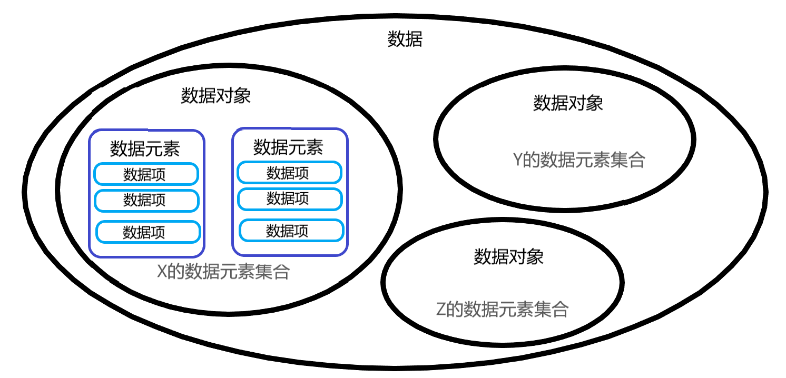
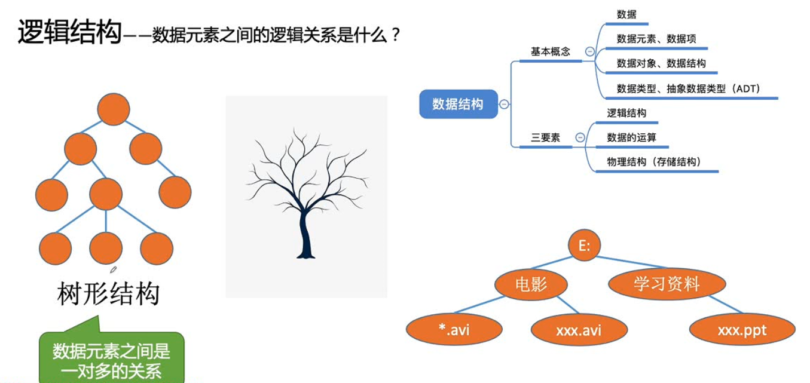

# 第一章 数据结构概论

## 1.1 数据结构起源

&emsp;&emsp;**数据结构**是一门研究非数值计算的程序设计问题中的操作对象，以及它们之间的关系和操作等相关问题的学科。早期计算机理解为数值计算工具，所以用计算机解决问题，应该先从具体问题中**抽象出适当的数据模型**，设计解决数据模型的算法，编写程序得到的软件。为了更好的解决问题，需要使用更科学有效的手段（表、树、图等数据结构）。  

&emsp;&emsp;**程序设计 = 数据结构 + 算法**  

## 1.2 基本概念和术语

&emsp;&emsp;数据 > 数据对象 > 数据元素（基本单位） > 数据项（最小单位）

- **数据**：描述客观事物的符号，是计算机中可以操作的对象，是能被计算机识别，并输入给计算机处理的符号集合。数据不仅仅包括**整型、实型（浮点型）等数值类型**，还包括**字符及声音、图像、视频等非数值类型**。

- **数据元素**：是组成数据的、有一定意义的基本单位，在计算机中通常作为整体处理，也被称为记录。例如在人类中，人是数据元素。在畜禽类中，鸡鸭鹅等是数据元素。数据元素用于描述一个个体。是数据结构中建立数据模型的着眼点。

　　

　　

- **数据项**：—个数据元素可以由若干个数据项组成。数据项是数据不可分割的最小单位。描述个体（种类）的具体字段。

　　​

- **数据对象**：是性质相同的数据元素的集合，是数据的子集。性质相同是指数据元素具有相同数量和类型的数据项，比如人都有姓名、生日、性别等相同的数据项（字段）。

- **数据结构**：是相互之间存在一种或多种**特定关系**的数据元素的结合。结构，简单的理解就是关系。不同数据元素之间不是独立的，而是存在特定的关系，我们将这些关系（联系）称为结构。

## 1.3 逻辑结构与物理结构

### 1.3.1 逻辑结构

&emsp;&emsp;**逻辑结构**：是指数据对象中数据元素之间的相互关系，包括集合结构、线性结构（一对一）、非线性结构（一对多、多对多）。

- **集合结构**：集合结构中的数据元素除了同属于一个集合外，它们之间没有其他关系，数据结构中的集合关系就类似于数学中的集合。

- **线性结构**：线性结构中的数据元素之间是**一对一**的关系。

- 非线性结构（一对多、多对多）
  - **树形结构**：树形结构中的数据元素之间存在一种一对多的层次关系。
  
  

　

  - **图形结构**：图形结构的数据元素是多对多的关系。

　

　

&emsp;&emsp;逻辑结构是针对具体问题的，为了解决某个问题，在对问题的理解基础上，选择一个合适的数据结构表示数据元素之间的逻辑关系。

### 1.3.2 物理（存储）结构

&emsp;&emsp;**物理结构**：是指数据的逻辑结构在计算机中的存储形式，因此也称为存储结构。数据是数据元素的集合，如何把数据元素存储到计算机的存储器中，并且数据的存储结构应正确反映数据元素之间的逻辑关系。这是实现物理结构的重点和难点。数据元素的存储结构形式有两种：**顺序存储和链式存储**。

- **顺序存储结构**：是把数据元素存放在地址连续的存储单元里（物理地址上相邻），其数据间的**逻辑关系和物理关系**是一致的。

　　

- **链式存储结构**：是把数据元素存放在任意的存储单元里，这组存储单元**可以是连续的，也可以是不连续的**。

　　

&emsp;&emsp;链式存储灵活很多，数据存在哪里不重要，只要有一个指针存放了相应的地址就能找到对应的数据。地址上不相邻，通过指针描述前后关系。

　　

&emsp;&emsp;逻辑结构是面向问题的，而物理结构就是面向计算机的，其基本的目标就是将数据及其逻辑关系存储到计算机的内存中。

## 1.4 数据类型

&emsp;&emsp;**数据类型是按照值的不同进行划分的。**在高级语言中，每个变量、常量和表达式都有各自的取值范围。类型就用来说明变量或表达式的取值范围和所能进行的操作。所以对数据进行分类，分出来多种数据类型，用来满足不同计算的需求。

&emsp;&emsp;在高级程序设计语言中，按"值"的不同特性，可将数据类型分为两类。
- **原子类型**：整型、实型、字符型等
- **结构类型**：结构体、数组等

&emsp;&emsp;**抽象是指抽取出事物具有的普遍性的本质**。它是抽出问题的特征而忽略非本质的细节，是对具体事物的一个概括。抽象是一种思考问题的方式，隐藏了繁杂的细节，只保留实现目标所必需的信息。

&emsp;&emsp;**抽象数据类型**：一个数学模型及定义在该模型上的**一组操作。**
