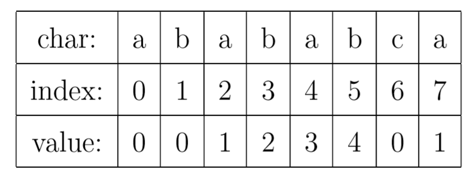
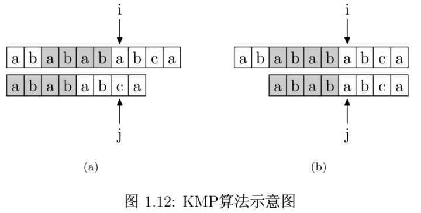
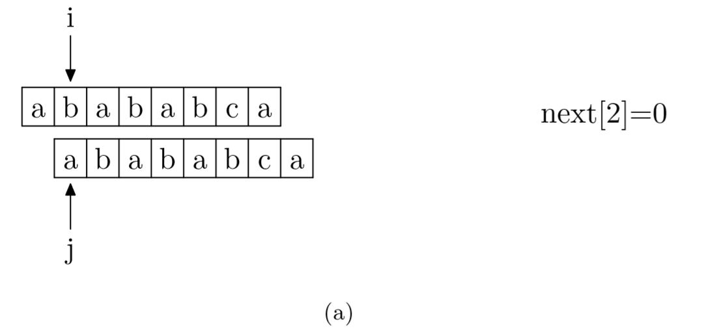
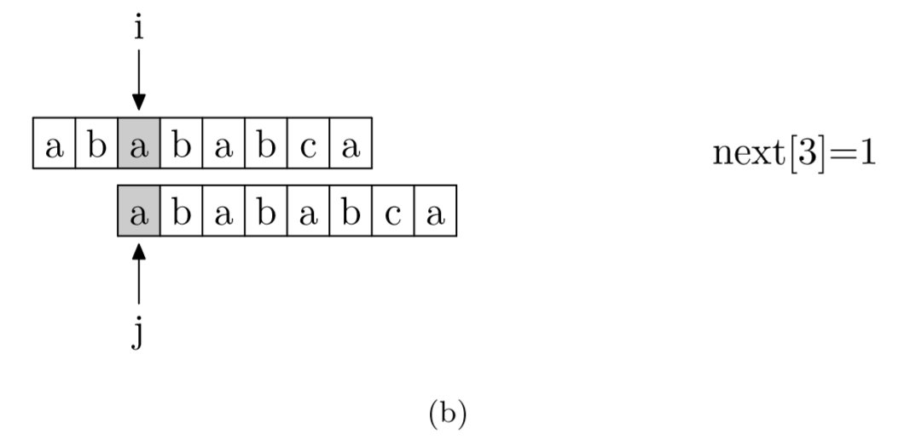
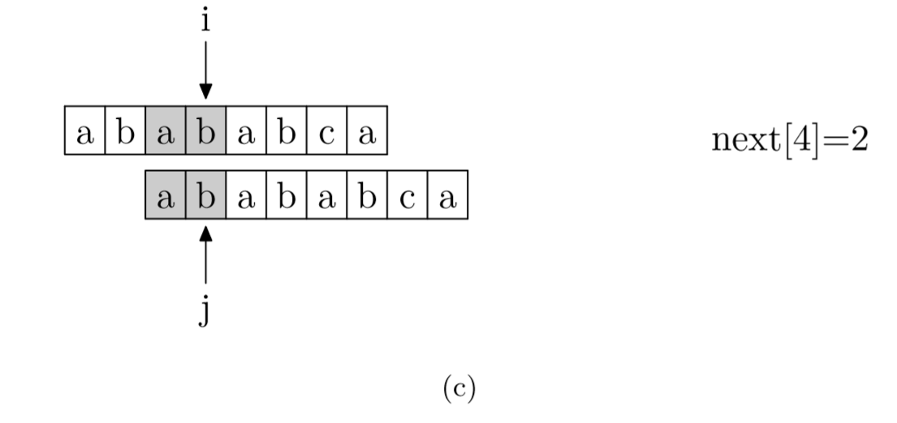
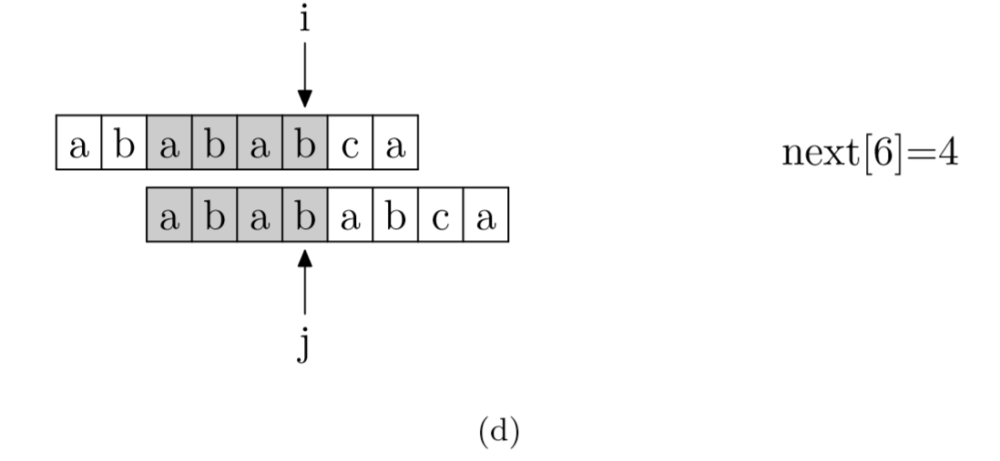
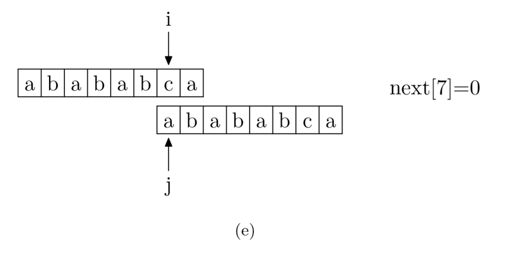

# 第五章 串

## 5.1 串的定义

- 串：英文称 `string`，又叫字符串，是由零个或多个字符组成的有限序列。
- 串的长度：串中的字符数目
- 空串：零个字符的串，它的长度为0，可以直接用双引号""表示
- 子串与主串：串中任意个数的连续字符组成的子序列称为该串的子串，相应地包含子串的串称为主串。

```python
str1 = "123"  # 字符串，长度为3
str2 = ""  # 空串，长度为0
str3 = "hello"  # 子串
str3 = "hello world"  # 主串
```

## 5.2 串的比较

- 比较原理：串的比较是通过组成串的字符之间的编码来进行的，而字符的编码指的是字符在对应字符集中的序号。
- 比较规则：首先比较两个字符串中的第一个字符，如果相等则继续比较下一个字符，依次比较下去，直到两个字符串中的字符不相等时，其比较结果就是两个字符串的比较结果，两个字符串中的所有后续字符将不再被比较
- 比较操作运算符：>，>=，<，<=，==，!=

```python
print("hello" > "hel")  # True
print("hello" > "interest")  # False
print(ord("h"), ord("i"))  # 104 < 145  调用内置函数ord可以得到指定字符的ASCII码
print(ord("G") < ord("g"))  # True G：71, g:103  所以：G<g

a = b = "123"
c = "123"
print(a == b)  # True
print(a is b)  # True
print(a == c)  # True
# == 与 is 的区别：== 比较的是value；is 比较的是id
print(a is c)  # True，Pycharm做了优化，“123”在驻留池中，a，b，c存储的都是对“123”的引用
```

## 5.3 串的数据类型和存储结构

### 5.3.1 串的数据类型

&emsp;&emsp;线性表关注的是的单个元素的操作，比如增删查改。串更多的是查找子串位置，得到指定位置子串、替换子串等操作。

&emsp;&emsp;字符串是数据元素类型为字符的线性表，其抽象数据类型描述与线性表相似。串的存储结构与线性表相同，分为顺序与链式存储。

### 5.3.2 串的顺序存储

&emsp;&emsp;串的顺序存储结构是**用一组地址连续的存储单元（一般用定长数组表示）**来存储串中的字符序列的。

- 缺点：长度需要遍历，并且拼接、插入、替换可能会超过数组的长度，造成数组越界。
- 改进：将串的存储空间在程序执行过程中动态分配，比如自由存储区（堆）。

### 5.3.3 串的链式存储结构

一个结点可以存储一个或者多个字符。

- 缺点：不如顺序存储灵活，性能也不如顺序存储结构好。

## 5.4 串的模式匹配算法

### 5.4.1 朴素模式匹配算法

子串的定位操作通常称为串的模式匹配。

- 主串：S，索引i表示（例如：goodgoogle）
- 子串：T，索引j表示（例如：google）

**题目：**  
&emsp;&emsp;两个字符串S（主串）和T（子串），找出该子串在主串中的位置。
主串：S（例如：goodgoogle）
子串：T（例如：google）

**解法一的思路：**  
&emsp;&emsp;对主串的每一个字符作为子串的开头，与要匹配的字符串进行匹配。对主串做大循环，每个字符开始做子串长度的小循环，直到匹配成功或者全部遍历完成为止。

**时间复杂度**：$O(m+n)$

```python
"""
朴素的字符串模式匹配算法
"""
def naive_string_match(S, T):
    n = len(S)
    m = len(T)

    for j in range(0, n - m + 1):
        k = 0
        for i in range(0, m):
            if S[j + i] != T[i]:
                break
            else:
                k += 1
        if k == m:
            print(j)


if __name__ == '__main__':
    S = "goodgoogle"
    T = "google"
    naive_string_match(S, T)
```  

**解法二的思路：**   
&emsp;&emsp;先用子串的第一个位置字符进行比较，匹配S中的第一位，`T(2)`匹配`S(2)`...，如果有一位没有匹配上，终止匹配，从T中的第二位开始匹配。

```python
"""
朴素的字符串模式匹配算法
"""
def naive_string_match2(S, T):
    i = 0
    _index = None
    _is_exists = False
    while i < len(S):
        if T == S[i:i + len(T)]:
            _is_exists = True
            _index = i
            break
        else:
            i = i + 1
    return _is_exists, _index


if __name__ == '__main__':
    S = "goodgoogle"
    T = "google"
    is_exists, index = naive_string_match2(S, T)
    print(is_exists, (str(index) + ":" + str(index + len(T))))
```

### 5.4.2 KMP模式匹配算法

&emsp;&emsp;**KMP算法**是一种改进的字符串匹配算法，由 D.E.Knuth，J.H.Morris 和 V.R.Pratt 提出的，因此称为克努特—莫里斯—普拉特操作（简称KMP算法）。KMP算法的核心是利用匹配失败后的信息，尽量减少模式串与主串的匹配次数以达到快速匹配的目的。具体实现就是通过一个`next()`函数实现，函数本身包含了模式串的局部匹配信息。KMP算法的时间复杂度为 $O(m+n)$。

&emsp;&emsp;**字符串匹配**比较经典的算法就是**BF算法**和**KMP算法**。

&emsp;&emsp;**KMP算法与BF算法的不同**：这两种算法都是用**模式串（p**）去匹配**主串（s）**。在BF算法，每次匹配失败的时候，都要回溯到主串下一个字符继续和模式串开头比较，在模式串比较长的时候，这种算法的**效率**就比较低。KMP算法的改进在于引进了**next[]数组**，在匹配过程中产生**失配**时，主串不用回溯，而模式串则退回next[]数组**所指示的位置。**

&emsp;&emsp;**KMP算法的核心**，是一个被称为 **部分匹配表(Partial Match Table)** 的数组。

&emsp;&emsp;先来解释一下这个数据到底是什么。对于字符串“abababca”，它的PMT如下表所示：



&emsp;&emsp;如果待匹配的模式字符串有8个字符，那么PMT就会有8个值。

&emsp;&emsp;**PMT中的值是字符串的前缀集合与后缀集合的交集中最长元素的长度**。

&emsp;&emsp;例如，对于 "aba" ，它的前缀集合为 {"a", "ab"} ，后缀 集合为 {"ba", "a"} 。两个集合的交集为 {"a"} ，那么长度最长的元素就是字符串 "a" 了，长度为1，所以对于 "aba" 而言，它在PMT表中对应的值就是1。再比如，对于字符串 "ababa" ，它的前缀集合为 {"a", "ab", "aba", "abab"} ，它的后缀集合为 {"baba", "aba", "ba", "a"} ， 两个集合的交集为 {"a", "aba"} ，其中最长的元素为 "aba" ，长度为3。

&emsp;&emsp;我们再来看如何使用这个表来加速字符串的查找。如下图所示，在`i`处失配，那么主字符串和模式字符串的前面6位就是相同的。又因为模式字符串的前6位，它的前4位前缀和后4位后缀是相同的，所以我们推知主字符串`i`之前的4位和模式字符串开头的4位是相同的。就是图中的灰色部分，那这部分就不用再比较了。



&emsp;&emsp;有了上面的思路，我们就可以使用PMT加速字符串的查找了。我们看到如果是在`j`位失配，那么影响`j`指针回溯的位置的其实是第`j−1`位的 PMT 值，所以为了编程的方便，不直接使用PMT数组，而是将PMT数组向后偏移一位。我们把新得到的这个数组称为`next`数组。下面给出根据`next`数组进行字符串匹配加速的字符串匹配程序。其中要注意的一个技巧是，在把PMT进行向右偏移时，第0位的值，我们将其设成了-1，这只是为了编程的方便，并没有其他的意义。在本节的例子中，next数组如下表所示。


&emsp;&emsp;求`next`数组的过程完全可以看成字符串匹配的过程，即以模式字符串为主字符串，以模式字符串的前缀为目标字符串，一旦字符串匹配成功，那么当前的`next`值就是匹配成功的字符串的长度。

&emsp;&emsp;具体来说，就是从模式字符串的第一位（注意，不包括第0位）开始对自身进行匹配运算。 在任一位置，能匹配的最长长度就是当前位置的`next`值。如下图所示：











```python
def kmp(s, p):
    """
    s为主串, p为模式串, 如果s里有p，返回开始下标
    """
    next = get_next(p)
    i = 0
    j = 0  # 分别是s和p的指针
    while i < len(s) and j < len(p):
        if j == -1 or s[i] == p[j]:  # j==-1是由于j=next[j]产生
            i += 1
            j += 1
        else:
            j = next[j]

    if j == len(p):  # j走到了末尾，说明匹配到了
        return i - j
    else:
        return -1


def get_next(p):
    """
    p为模式串
    返回next数组，即部分匹配表
    """
    next = [0] * (len(p) + 1)
    next[0] = -1  # 在把PMT进行向右偏移时，第0位的值，我们将其设成了-1，是为了编程的方便
    i = 0
    j = -1
    while i < len(p):
        if j == -1 or p[i] == p[j]:
            i += 1
            j += 1
            next[i] = j  # 这是最大的不同：记录next[i]
        else:
            j = next[j]

    return next


if __name__ == '__main__':
    print(kmp("ababababca", "abababca"))  # 2
```

## 5.5 总结

- 串（string）是由零个或多个字符组成的有限序列，又叫字符串。
- 本质上，它是一种线性表的扩展，但相对于线性表关注一个个元素来说，我们对串这种结构更多的是关注它子串的应用问题，如查找、替换等操作。
- 现在的高级语言都有针对串的函数可以调用。我们在使用这些函数的时候，同时也应该理解它的原理，以便于在碰到复杂的问题时可以更加灵活地使用。
- KMP算法简述：利用匹配失败后的信息，尽量减少模式串与主串的匹配次数以达到快速匹配的目的。利用部分匹配表，求next数组。

## 5.6 习题

### 习题1 字符串语句逆序（简单）

**描述**

将一个英文语句以单词为单位逆序排列。输入一个英文语句，每个单词用空格隔开，保证输入只包含空格和字母。得到逆序的句子。

**示例 1:**
输入: "I am a boy"
输出: "boy a am I"

**示例 2:**
输入: "hello world"
输出: "world hello"

```python
def reverse_words(s):
    return ' '.join(s.split()[::-1])


if __name__ == '__main__':
    print(reverse_words("I am a boy"))  # boy a am I
    print(reverse_words("hello world"))  # world hello
```

### 习题2 字符出现情况（简单）

输入两个字符串，验证一个字符串中的每一个字符是否均在另一个字符串中出现。

**示例 1:**
输入: "abc"  "ncab"
输出: True

**示例 2:**
输入: "hello" "world"
输出: False

```python
def char_find(str1, str2):
    flag = True
    for ch1 in list(set(str1)):
        if ch1 not in list(set(str2)):
            flag = False
            break
    return flag


if __name__ == '__main__':
    s1 = "abc"
    s2 = "ncab"
    s3 = "hello"
    s4 = "world"
    print(char_find(s1, s2))  # True
    print(char_find(s3, s4))  # False
```

### 习题3 第一个出现两次的字符（简单）

找出字符串中第一个出现两次的字符。

**示例 1:**
输入: "abccba"
输出: "c"

**示例 2:**
输入: "1a2b3c41"
输出: "1"

```python
def repeated_char(s):
    # 用集合一次遍历找到第一个已经出现在集合中的元素即可
    res = set()
    for ch in s:
        if ch in res:
            return ch
        res.add(ch)


if __name__ == '__main__':
    s1 = "abccba"
    s2 = "1a2b3c41"
    print(repeated_char(s1))  # c
    print(repeated_char(s2))  # 1
```

### 习题4 字符串变形（中等）

把这个字符串中由空格隔开的单词反序，同时反转每个字符的大小写。

**示例 1:**
输入: "Hello World"
输出: "wORLD hELLO"

**示例 2:**
输入: "I am a boy"
输出: "BOY A AM i"

```python
def trans_chars(s):
    res = ""
    for i in s.split(' ')[::-1]:  # 按空格反转字符串列表
        i = i.swapcase()  # 对字符串的大小写字母进行转换
        res += (i + ' ')  # 字符串追加空格
    return res[:-1]  # 去掉最后一个空格


if __name__ == '__main__':
    s1 = "Hello World"
    s2 = "I am a boy"
    print(trans_chars(s1))  # wORLD hELLO
    print(trans_chars(s2))  # BOY A AM i
```


### 习题5 最长公共前缀（中等）

**描述**

查找字符串数组中的最长公共前缀。如果不存在公共前缀，返回空字符串 `""`。

**示例 1:**
输入: ["cat", "cool", "dog"]
输出: ""
解释: 因为不存在公共前缀，所以返回""。

**示例 2:**
输入: ["cat", "car", "camera"]
输出: "ca"
解释: 因为存在公共前缀"ca"，所以返回"ca"。

```python
def longest_common_prefix(str_list):
    result = ""
    for tmp in zip(*str_list):  # zip压缩
        tmp_set = set(tmp)  # 转为set
        if len(tmp_set) == 1:  # 长度为1，即为相同元素，添加到结果中
            result += tmp[0]
        else:
            break
    return result


if __name__ == '__main__':
    print(longest_common_prefix(["cat", "cool", "dog"]))  # ""
    print(longest_common_prefix(["cat", "car", "camera"]))  # "ca"
```

### 习题6 最长不含重复字符的子字符串（困难）

**描述**

从字符串中找出一个最长的不包含重复字符的子字符串，计算该最长子字符串的长度。

**示例 1:**
输入: "aaaaa"
输出: 1
解释: 因为无重复字符的最长子串是 "a"，所以其长度为 1。

**示例 2:**
输入: "abcabcbb"
输出: 3
解释: 因为无重复字符的最长子串是 "abc"，所以其长度为 3。

```python
def length_of_longest_substring(s):
    dic = {}
    tail = 0
    result = 0
    for i in range(len(s)):
        if s[i] in dic:  # 在字典中时，对tail进行重新赋值
            tail = max(dic[s[i]] + 1, tail)
        dic[s[i]] = i  # 更新字典
        result = max(result, i - tail + 1)  # 更新结果
    return result


if __name__ == '__main__':
    print(length_of_longest_substring("aaaaa"))  # 1
    print(length_of_longest_substring("abcabcbb"))  # 3
```
