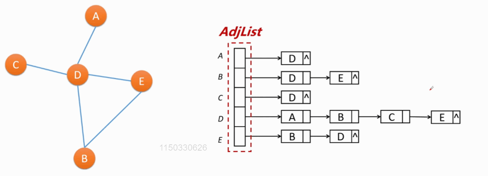
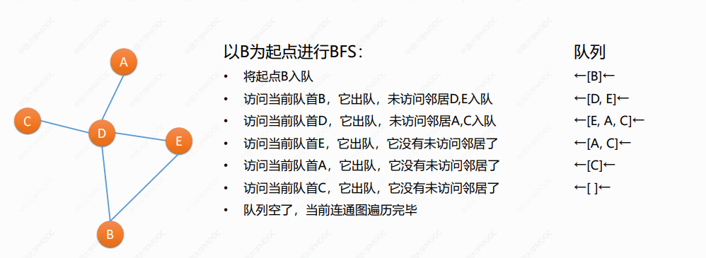
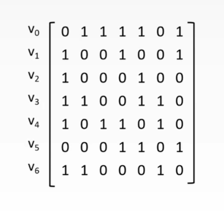
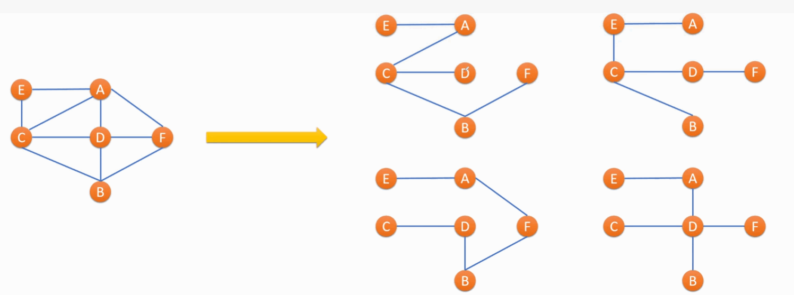
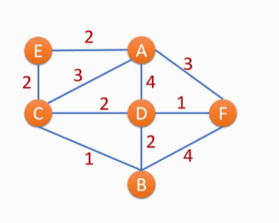
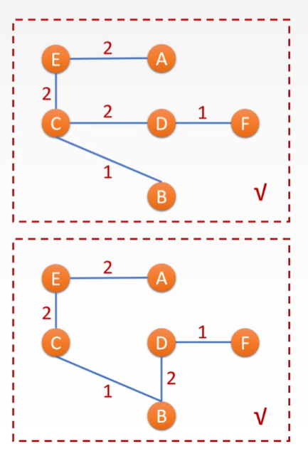
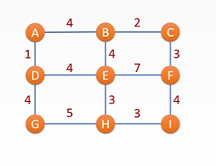
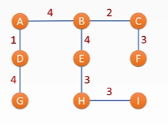

# 第七章 图
  ​
## 7.1 图的基本概念

　　图：图（Graph）是由顶点的有穷非空集合和顶点之间边的集合组成的。通常表示为 `G(V,E)`​，其中，`G`​ 表示—个图，`V`​ 是图 `G`​ 中**顶点的集合**，`E`​ 是图 `G`​ 中**边的集合**。

　　**图是多对多的逻辑结构。**

* 假设 ABCDEFG 是 7 个电话，之间的连线表示有通信线路
* **电话**就是**图的顶点**，**通信线路**是**边**，整体就是一个图
* 任意两个电话间有线路，就可以相互通话（无向图）
* 电话（顶点）连接的线路**（边）的数量**就是**度**
* ​`ABCD`​ 和 `GF`​ 之间消息**无法传递**，就是**不连通**
* ​`ABCD`​ 和 `GF`​ 是两个 **连通分量**

　　 

* 假设 `ABCDE`​ 是五个电话，之间的连线表示修有通信线路有，数字表示该线路的电话费
* 不同通信线路上的电话费不同：**加权图 **

　　

* 假设 `ABCDE`​ 是五个城市，带箭头连线表示该方向上有航班飞行
* 例如航班 `A`​——>`D`​ 只能支持 `A`​ 飞往 `D`​，边是单向的（**有向图**）
* 飞来某地的航班数量：**入度**
* 从某地起飞的航班数量：**出度**

　　

　　图并非只能表示地理数据，只要数据元素间满足多对多关系即可。

　　**问：**

1. 几个学生之间的朋友关系 用什么图表示？
2. 社交媒体的关注/粉丝关系 用什么图表示？
3. 多个耗时不同的任务之间的依赖关系 用什么图表示？

　　**答：**

1. 无向有权图
2. 有向无权图
3. 有向加权图

　　**知识点：**

> 无向和有向的区别在于，关系上是双向还是单向，如果所有路径都是双向则为无向图，有单向的路径则有向图。
>
> 无权和加权的区别在于，是否有消耗或者是费用等附加量，有则为加权图，没有则为无权图。
>
> 在一个**无向图**中，所有顶点的**度数之和**为**边数量的 2 倍**，边数最多为 $结点数*(结点数-1)/2$。
>
> 在一个**有向图**中，所有顶点的**出度之和**为所有顶点的**入度之和**。

## 7.2 邻接矩阵和邻接表

### 7.2.1 邻接矩阵

* 图可用一个 `n*n`​ 方阵表示
* 即一个二维数组 `AdjMat[n][n]`​
* ​`AdjMat[i][j]`​ 表示 `vi`​ 到 `vj`​ 的邻接情况

　　**无向无权图：**

　　

　　**有向加权图：**

　　

### 7.2.2 邻接表

* 每个顶点用一个链表存下自己的邻居
* 有 `n`​ 个链表，即图可用一个链表的数组 `Adjlist[n]`​ 存储
* ​`Adjlist[i]`​ 表示顶点 `vi`​ 的链表（头结点）
* 从 `Adjlist[i]`​ 开始考研遍历所有 `vi`​ 的邻居

　　

### 7.2.3 邻接矩阵和邻接表的比较

　　**邻接矩阵**无论如何**都需要一个二维数组** `[n][n]`​ ，而**邻接表**中每条链表长度**取决于它有多少邻居（即边越少，占空间越小）。**

　　**邻接矩阵**访问 `AdjMat[i][j]`​ 是 $O(1)$ 的，但邻接表访问特定边需要顺着起点的**链表向后查找** $O(N)$

　　‍

　　**邻接表的优点**：在边较少时节省许多空间，使用于**稀疏图**（边少）

　　**邻接表的缺点**：无法直接获取某条边的信息，需要 vi 链表进行从头顺序存取，最坏情况下 $O(N)$

## 7.3 图的 DFS 和 BFS 遍历

### 7.3.1 DFS：深度优先遍历

　　使用**递归/栈**实现

　　从起点开始，优先遍历除了自己以外的结点中，未访问过的结点。

　　

　　**问：**

　　给定如下邻接矩阵，写出由 `v0`​ 出发的一个 DFS 序列。

　　

　　**答：**

　　​

### 7.3.2 BFS：广度优先遍历

　　也称为**层序遍历**

　　使用**队列**实现

　　

　　

　　**问：**

　　给定如下邻接矩阵，写出由 `v0`​ 出发的深度优先遍历结果为（），广度优先遍历结果为（）。

　　

　　**答：**

1. 0123
2. 0123

## 7.4 最小生成树

### 7.4.1 生成树

　　对于含 n 个结点的一个无向连通图，其边数最多为 $n(n-1)/2$ 条，最少为 $n-1$ 条

　　保持连通性的情况下，选 $n-1$ 条边出来，剔除其他边（去闭环），它就变成了一棵树

　　生成树中没有环。

　　$n 个结点 + n-1 条边 + 连通 = 生成树$

　　

### 7.4.2 最小生成树 MST

　　在加权图中选出 $n-1$ 条边来构成生成树，使得这个生成树边的权值之和最小，则称这个生成树为最小生成树（MST）。

　　MST 不一定唯一（如最小权值相同的生成树有多个）。

　　

　　

　　**问：**

　　MST 的意义是什么？

　　**答：**

　　求在多个解决方案中，消耗或者是费用最小的解决方案。

　　如：城市造路，求花费最小的造路方案。

### 7.4.3 求最小生成树：Prim 算法

　　也称为 **加点法。**

　　使用什么策略才能构造出最小生成树呢？

　　贪心的思想，每次在连接**已完成结点和未完成结点的边中**，选一条权值最小的，重复 $n-1$ 遍。局部最优使得全局最优。

　　每次加点满足：这个点所属边的权值最小，加点不会形成环。

　　**问：**

　　给定如下图结构，求其最小生成树。

　　

　　**答：**

　　

　　‍

## 7.5 迪杰斯特拉算法

　　单源点最短路径：Dijkstra 算法

　　加权图中求从一个顶点 s 出发到其他各点的最短距离

　　算法循环 n-1 次，每次执行以下操作：

1. 找到未完成结点中，s->t 距离最短的 t，将 t 标注未已完成
2. 以 t 为中转更新 s 至 t 的邻居们的距离

　　

　　‍
