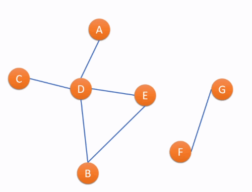
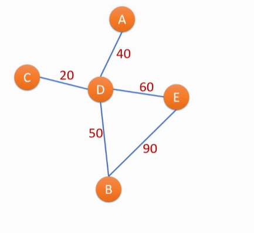
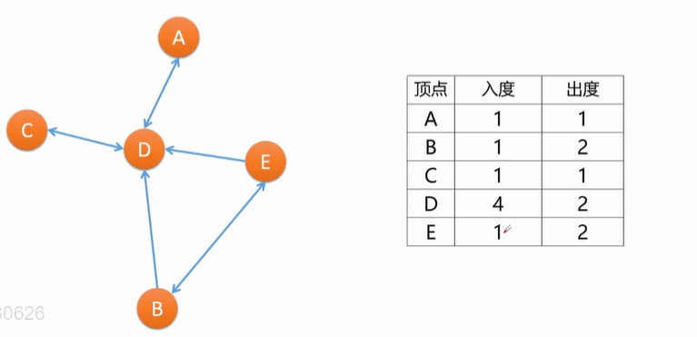
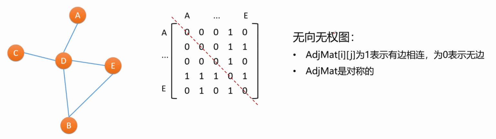
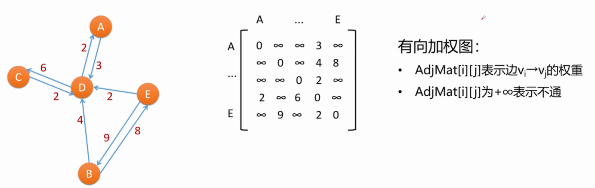

# 第七章 图

## 7.1 图的基本概念

　　图：图（Graph）是由顶点的有穷非空集合和顶点之间边的集合组成的。通常表示为 `G(V,E)`​，其中，`G`​ 表示—个图，`V`​ 是图 `G`​ 中**顶点的集合**，`E`​ 是图 `G`​ 中**边的集合**。

　　**图是多对多的逻辑结构。**

* 假设 ABCDEFG 是 7 个电话，之间的连线表示有通信线路
* **电话**就是**图的顶点**，**通信线路**是**边**，整体就是一个图
* 任意两个电话间有线路，就可以相互通话（无向图）
* 电话（顶点）连接的线路**（边）的数量**就是**度**
* ​`ABCD`​ 和 `GF`​ 之间消息**无法传递**，就是**不连通**
* ​`ABCD`​ 和 `GF`​ 是两个 **连通分量**

　　 

* 假设 `ABCDE`​ 是五个电话，之间的连线表示修有通信线路有，数字表示该线路的电话费
* 不同通信线路上的电话费不同：**加权图 **

　　

* 假设 `ABCDE`​ 是五个城市，带箭头连线表示该方向上有航班飞行
* 例如航班 `A`​——>`D`​ 只能支持 `A`​ 飞往 `D`​，边是单向的（**有向图**）
* 飞来某地的航班数量：**入度**
* 从某地起飞的航班数量：**出度**

　　

　　图并非只能表示地理数据，只要数据元素间满足多对多关系即可。

　　**问：**

1. 几个学生之间的朋友关系 用什么图表示？
2. 社交媒体的关注/粉丝关系 用什么图表示？
3. 多个耗时不同的任务之间的依赖关系 用什么图表示？

　　**答：**

1. 无向有权图
2. 有向无权图
3. 有向加权图

　　**知识点：**

> 无向和有向的区别在于，关系上是双向还是单向，如果所有路径都是双向则为无向图，有单向的路径则有向图。
>
> 无权和加权的区别在于，是否有消耗或者是费用等附加量，有则为加权图，没有则为无权图。
>
> 在一个**无向图**中，所有顶点的**度数之和**为**边数量的 2 倍**，边数最多为 $结点数*(结点数-1)/2$。
>
> 在一个**有向图**中，所有顶点的**出度之和**为所有顶点的**入度之和**。

## 7.2 邻接矩阵和邻接链表

### 7.2.1 邻接矩阵

* 图可用一个 `n*n`​ 方阵表示
* 即一个二维数组 `AdjMat[n][n]`​
* ​`AdjMat[i][j]`​ 表示 `vi`​ 到 `vj`​ 的邻接情况

　　**无向无权图：**

　　

　　**有向加权图：**

　　

### 7.2.2 邻接链表

## 7.3 图的 DFS 和 BFS 遍历

　　‍

　　‍

## 7.4 最小生成树

　　‍

　　‍

## 7.5 迪杰斯特拉算法

　　‍

　　‍

## 7.6 拓扑排序

　　‍

　　‍

## 7.7 AOE 网络与关键路径求解

　　‍

　　‍
