# 第8章 查找

## 1. 查找的基本概念

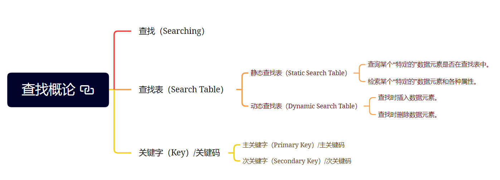

- 查找（Searching）：根据给定的某个值，在查找表中确定一个其关键字等于给定值的数据元素（或记录）。
- 查找表（Search Table）：由同一类型的数据元素（或记录）构成的集合。
- 关键字（Key）/关键码：数据元素中某个数据项的值，又称为键值，可以标志一个数据元素，也可以标志一个记录的某个数据项（字段）。
- 主关键字（Primary Key）/主关键码：若关键字可以唯一地标志一个记录，则称为主关键字。
- 次关键字（Secondary Key）/次关键码：对于那些可以识别多个数据元素（或记录）的关键字，称为次关键字。
- 静态查找表（Static Search Table）：只做查找操作的查找表，主要操作是查询某个“特定的”数据元素是否在查找表中，检索某个“特定的”数据元素和各个属性。
- 动态查找表（Dynamic Search Table）：在查找过程中同时插入查找表中不存在的数据元素，或者从查找表中删除已经存在的某个数据元素，主要操作是查找时插入数据元素，查找时删除数据元素。

## 2. 顺序表查找

&emsp;&emsp;顺序查找（Sequential Search）又叫做线性查找，是最基本的查找技术，它的查找过程是：从表中第一个（或最后一个）记录开始，逐个进行记录的关键字和给定值比较，若某个记录的关键字和给定值相等，则查找成功，找到所查的记录；如果直到最后一个（或第一个）记录，其关键字和给定值比较都不等时，则表中没有所查的记录，查找不成功。

&emsp;&emsp;顺序表查找算法：

```java
public static int Sequential_Search<T>(T[] record, T key)
    where T : IComparable<T>
{
    for (int i = 0; i < record.Length; i++)
    {
        if (record[i].CompareTo(key) == 0)
            return i;
    }
    return -1;
}
```

## 3. 有序表查找

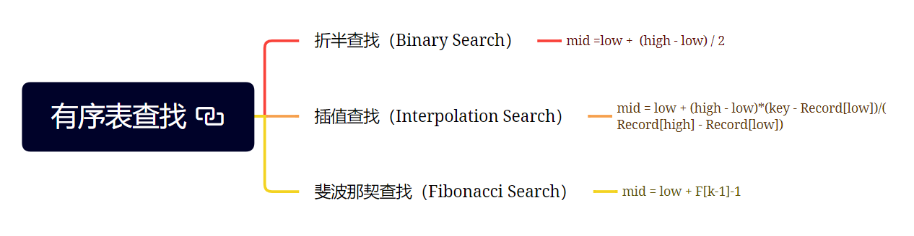

&emsp;&emsp;折半查找（Binary Search），又称为二分查找。前提是线性表中的记录必须是关键码有序（通常从小到大有序），线性表必须采用顺序存储。折半查找的基本思想是：在有序表中，取中间记录作为比较对象，若给定值与中间记录的关键字相等，则查找成功；若给定值小于中间记录的关键字，则在中间记录的左半区继续查找；若给定值大于中间记录的关键字，则在中间记录的右半区继续查找。不断重复上述过程，直到查找成功，或所有查找区域无记录，查找失败为止。

&emsp;&emsp;插值查找（Interpolation Search），是根据要查找的关键字`key`与查找表中最大最小记录的关键字比较后的查找方法，其核心就在于插值的计算公式
$$
\frac{\text{key} - \text{a}[\text{low}]}{\text{a}[\text{high}] - \text{a}[\text{low}]}
$$

&emsp;&emsp;斐波那契查找（Fibonacci Search），是利用了黄金分割原理来实现的，算法的核心如下：
- 当`key = a[mid]`时，查找成功
- 当`key < a[mid]`时，新范围是第`low`个到第`mid-1`个，此时范围个数为 $F[k-1] - 1$ 个
- 当`key > a[mid]`时，新范围是第 $m + 1$ 个到第`high`个，此时范围个数为 $F[k-2] - 1$ 个

&emsp;&emsp;折半查找代码：

```java
public static int Binary_Search<T>(T[] record, T key)
    where T : IComparable<T>
{
    int low = 0;
    int high = record.Length - 1;

    while (low <= high)
    {
        int mid = (low + high) / 2;

        if (record[mid].CompareTo(key) < 0)
            low = mid + 1;
        else if (record[mid].CompareTo(key) == 0)
            return mid;
        else
            high = mid - 1;
    }
    return -1;
}
```

&emsp;&emsp;插值查找代码：

```java
public static int Interpolation_Search<T>(T[] record, T key)
    where T : IComparable<T>, ISubtract<T>
{
    int low = 0;
    int high = record.Length - 1;

    if (key.Subtract(record[low]) < 0 || key.Subtract(record[high]) > 0)
        return -1;

    while (low <= high)
    {
        int mid = (low == high)
            ? low
            : low + (int)(key.Subtract(record[low]) / record[high].Subtract(record[low])
                            * (high - low));

        if (record[mid].CompareTo(key) < 0)
            low = mid + 1;
        else if (record[mid].CompareTo(key) == 0)
            return mid;
        else
            high = mid - 1;
    }
    return -1;
}
```

&emsp;&emsp;斐波那契查找代码：

```java
private const int MAXSIZE = 50;
private static int[] _fibonacciArray = new int[MAXSIZE];

public static int[] CalculateFibonacci()
{
    _fibonacciArray[0] = 1;
    _fibonacciArray[1] = 1;
    for (int i = 2; i < _fibonacciArray.Length; i++)
    {
        _fibonacciArray[i] = _fibonacciArray[i - 1] + _fibonacciArray[i - 2];
    }
    return _fibonacciArray;
}

public static int Fiboncci_Search<T>(T[] record, T key)
    where T : IComparable<T>
{
    int length = record.Length;
    int low = 0, high = length - 1, mid, k = 0;

    while (_fibonacciArray[k] < length)
        k++;

    T[] balance;
    if (_fibonacciArray[k] > length)
    {
        balance = new T[_fibonacciArray[k]];
        for (int i = 0; i < length; i++)
        {
            balance[i] = record[i];
        }
        for (int i = length; i < _fibonacciArray[k]; i++)
        {
            balance[i] = balance[length - 1];
        }
    }
    else
    {
        balance = record;
    }

    while (low <= high)
    {
        mid = low + _fibonacciArray[k - 1] - 1;
        if (balance[mid].CompareTo(key) > 0)
        {
            high = mid - 1;
            k -= 1;
        }
        else if (balance[mid].CompareTo(key) < 0)
        {
            low = mid + 1;
            k -= 2;
        }
        else
        {
            return mid < length ? mid : length - 1;
        }
    }
    return -1;
}
```

## 4. 线性索引查找

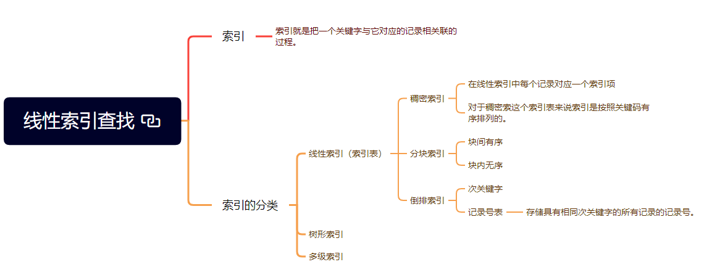

- 索引：把一个关键字与它对应的记录相关联的过程。
- 线性索引：将索引项集合组织为线性结构，也称为索引表。
- 稠密索引：在线性索引中，将数据集中的每个记录对应一个索引，索引项一定是按照关键码有序排列的。
- 分块索引：分块有序是把数据集的记录分成了若干块，并且这些块需要满足两个条件：块内无序（每一块内的记录不要求有序）、块间有序。
- 倒排索引：记录号表存储具有相同次关键字的所有记录的记录号（可以是指向记录的指针或者是该记录的主关键字），该索引方法被称为倒排索引。

稠密索引：

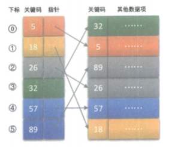


分块索引：

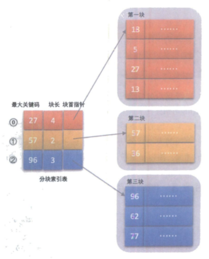

倒排索引：

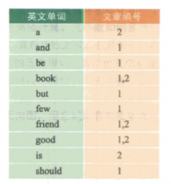

## 5. 二叉排序树

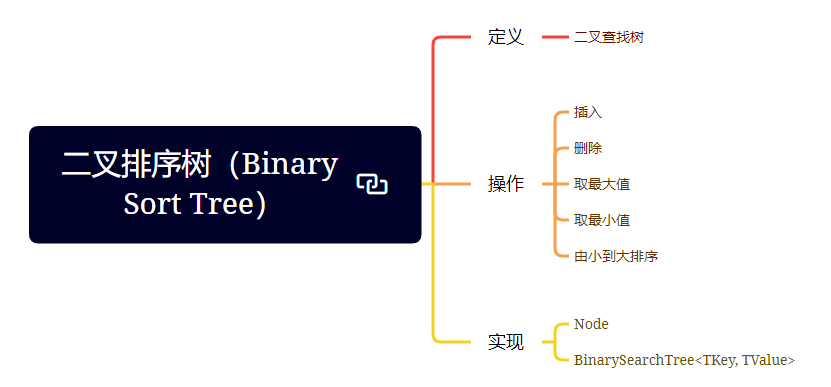

&emsp;&emsp;二叉排序树（Binary Sort Tree），又称为二叉查找树。它或者是一棵空树，或者是具有以下性质的二叉树。
- 若它的左子树不为空，则左子树上所有结点的值均小于它的根结点的值。
- 若它的右子树不为空，则右子树上所有结点的值均大于它的根结点的值。
- 它的左、右子树也分别为二叉排序树。

&emsp;&emsp;二叉排序树实现代码：

```java
/// <summary>
/// 表示符号表的接口
/// </summary>
public interface ISymbolTable<TKey, TValue>
    where TKey : IComparable<TKey>
{
    /// <summary>
    /// 往集合中插入一条键值对记录，如果value为空，不添加。
    /// </summary>
    /// <param name="key">需要插入的关键字</param>
    /// <param name="value">关键字对应的数据</param>
    void Insert(TKey key, TValue value);
    /// <summary>
    /// 删除关键字为key的记录
    /// </summary>
    /// <param name="key">要删除记录的关键字</param>
    void Delete(TKey key);
    /// <summary>
    /// 获取集合中键值对的个数
    /// </summary>
    int Length { get; }
    /// <summary>
    /// 获取key对应的value
    /// </summary>
    /// <param name="key">需要搜索的关键字</param>
    /// <returns>若找到，则返回对应的Value。否则返回default(TValue)。</returns>
    TValue this[TKey key] { get; }
    /// <summary>
    /// 判断集合中是否存在关键字为key的记录
    /// </summary>
    /// <param name="key">关键字</param>
    /// <returns>如果存在关键字为key的记录返回true，否则返回false。</returns>
    bool Contains(TKey key);
}
```

```java
public class BinarySearchTree<TKey, TValue> : ISymbolTable<TKey, TValue>
    where TKey : IComparable<TKey>
{
    /// <summary>
    /// 在实现中，我们需要定义一个内部类Node，
    /// 它包含两个分别指向左右结点的Node，
    /// 一个用于排序的Key，以及该结点包含的值Value。
    /// </summary>
    private class Node
    {
        public Node LeftChild
        {
            get;
            set;
        }
        public Node RightChild
        {
            get;
            set;
        }
        public TKey Key
        {
            get;
        }
        public TValue Value
        {
            get;
            set;
        }

        public Node(TKey key, TValue value)
        {
            Key = key;
            Value = value;
        }
    }

    private Node _root = default(Node);
    private string _orderString = string.Empty;
    
    /// <summary>
    /// 获取二叉搜索树包含结点的个数
    /// </summary>
    public int Length
    {
        get;
        private set;
    } = 0;

    /// <summary>
    /// 获取key对应的value
    /// </summary>
    /// <param name="key">需要搜索的关键字</param>
    /// <returns>若找到，则返回对应的Value。否则返回default(TValue)。</returns>
    /// <remarks>
    /// 搜索操作和二分搜索类似，将key和结点的Key比较，
    /// 如果小于，那么就在LeftChild结点搜索，大于，则在RightChild结点搜索，
    /// 如果相等，直接返回value。
    /// </remarks>
    public TValue this[TKey key]
    {
        get
        {
            return GetValue(_root, key);
        }
    }

    private TValue GetValue(Node current, TKey key)
    {
        if (current == null)
        {
            return default(TValue);
        }

        int cmp = key.CompareTo(current.Key);
        if (cmp > 0)
        {
            return GetValue(current.RightChild, key);
        }
        if (cmp < 0)
        {
            return GetValue(current.LeftChild, key);
        }
        return current.Value;
    }

    /// <summary>
    /// 向二叉搜索树中插入数据
    /// </summary>
    /// <param name="key">需要插入的关键字</param>
    /// <param name="value">关键字对应的数据</param>
    /// <remarks>
    /// 插入和搜索类似，首先搜索有没有和key相同的，
    /// 如果有，更新；如果没有找到，那么创建新的节点。
    /// </remarks>
    public void Insert(TKey key, TValue value)
    {
        if (key == null)
        {
            throw new ArgumentNullException();
        }
        if (value == null)
        {
            throw new ArgumentNullException();
        }
        _root = Insert(_root, key, value);
    }

    private Node Insert(Node current, TKey key, TValue value)
    {
        //如果结点为空，则创建结点。
        if (current == null)
        {
            Length++;
            return new Node(key, value);
        }
        int cmp = key.CompareTo(current.Key);

        if (cmp < 0)
        {
            current.LeftChild = Insert(current.LeftChild, key, value);
        }
        else if (cmp > 0)
        {
            current.RightChild = Insert(current.RightChild, key, value);
        }
        else
        {
            current.Value = value;
        }
        return current;
    }

    /// <summary>
    /// 获取最大的关键字
    /// </summary>
    /// <remarks>
    /// 二叉搜索树的最大小值是有规律的。
    /// 最左和最右结点即为最小值和最大值。
    /// </remarks>
    public TKey Max
    {
        get
        {
            if (_root == null)
            {
                return default(TKey);
            }
            return getMax(_root);
        }
    }

    private TKey getMax(Node current)
    {
        if (current.RightChild == null)
        {
            return current.Key;
        }
        return getMax(current.RightChild);
    }

    /// <summary>
    /// 获取最小的关键字
    /// </summary>
    public TKey Min
    {
        get
        {
            if (_root == null)
            {
                return default(TKey);
            }
            return getMin(_root);
        }
    }

    private TKey getMin(Node current)
    {
        if (current.LeftChild == null)
        {
            return current.Key;
        }
        return getMin(current.LeftChild);
    }

    /// <summary>
    /// 删除二叉搜索树Key最小的结点
    /// </summary>
    /// <remarks>
    /// 我们首先找到最小值，即左边左子树为空的结点，
    /// 然后返回其右子树作为新的左子树。
    /// </remarks>
    public void DeleteMin()
    {
        if (_root == null) return;
        _root = DeleteMin(_root);
        Length--;
    }

    private Node DeleteMin(Node current)
    {
        if (current.LeftChild == null)
        {
            return current.RightChild;
        }
        current.LeftChild = DeleteMin(current.LeftChild);
        return current;
    }

    /// <summary>
    /// 删除二叉搜索树Key最大的结点
    /// </summary>
    /// <remarks>
    /// 我们首先找到最大值，即右边右子树为空的结点，
    /// 然后返回其左子树作为新的右子树。
    /// </remarks>
    public void DeleteMax()
    {
        if (_root == null) return;
        _root = DeleteMax(_root);
        Length--;
    }

    private Node DeleteMax(Node current)
    {
        if (current.RightChild == null)
        {
            return current.LeftChild;
        }
        current.RightChild = DeleteMax(current.RightChild);
        return current;
    }

    /// <summary>
    /// 判断二叉搜索树中是否存在关键字为key的记录
    /// </summary>
    /// <param name="key">关键字</param>
    /// <returns>如果存在关键字为key的记录返回true，否则返回false。</returns>
    public bool Contains(TKey key)
    {
        if (key == null)
            throw new ArgumentNullException();
        return Contains(_root, key);
    }

    private bool Contains(Node current, TKey key)
    {
        if (current == null) 
        {
            return false;
        }
        int cmp = key.CompareTo(current.Key);
        if (cmp > 0)
        {
            return Contains(current.RightChild, key);
        }
        if (cmp < 0)
        {
            return Contains(current.LeftChild, key);
        }
        return true;
    }

    /// <summary>
    /// 删除关键字为key的记录
    /// </summary>
    /// <param name="key">要删除记录的关键字</param>
    public void Delete(TKey key)
    {
        if (key == null)
            throw new ArgumentNullException();

        if (Contains(key))
        {
            _root = Delete(_root, key);
            Length--;
        }
    }

    private Node Delete(Node current, TKey key)
    {
        int cmp = key.CompareTo(current.Key);

        if (cmp > 0)
        {
            current.RightChild = Delete(current.RightChild, key);
        }
        else if (cmp < 0)
        {
            current.LeftChild = Delete(current.LeftChild, key);
        }
        else
        {
            if (current.LeftChild == null)
            {
                return current.RightChild;
            }
            if (current.RightChild == null)
            {
                return current.LeftChild;
            }
            Node temp = current;
            current = GetMinNode(temp.RightChild);
            current.RightChild = DeleteMin(temp.RightChild);
            current.LeftChild = temp.LeftChild;
        }
        return current;
    }

    private Node GetMinNode(Node current)
    {
        if (current.LeftChild == null)
        {
            return current;
        }
        return GetMinNode(current.LeftChild);
    }

    private Node GetMaxNode(Node current)
    {
        if (current.RightChild == null)
        {
            return current;
        }
        return GetMaxNode(current.RightChild);
    }

    /// <summary>
    /// 得到关键词的中序遍历序列
    /// </summary>
    /// <returns>关键词的中序遍历序列</returns>
    public string MidOrderTraversal()
    {
        _orderString = string.Empty;
        MidOrder(_root);
        return _orderString;
    }

    private void MidOrder(Node current)
    {
        if (current == null)
            return;
        MidOrder(current.LeftChild);
        _orderString += current.Key + " ";
        MidOrder(current.RightChild);
    }
}
```


## 6. 平衡二叉树（AVL树）

&emsp;&emsp;平衡二叉树（Self-Balancing Binary Search Tree 或  Height-Balanced Binary Search Tree），是一种二叉排序树，其中每一个结点的左子树和右子树的高度差至多等于1.

&emsp;&emsp;平衡二叉树实现代码：

```java
/// <summary>
/// 表示平衡二叉树的结构
/// </summary>
/// <typeparam name="TKey">表示关键字的类型</typeparam>
/// <typeparam name="TValue">表示关键字对应数据的类型</typeparam>
public class AVLTree<TKey, TValue> : ISymbolTable<TKey, TValue>
    where TKey : IComparable<TKey>
{
    private class Node
    {
        public Node LeftChild { get; set; }
        public Node RightChild { get; set; }
        public Node Parent { get; set; }
        public TKey Key { get; set; }
        public TValue Value { get; set; }

        /// <summary>
        /// 获取或设置结点的平衡因子
        /// </summary>
        public int BalanceFactor { get; set; }

        public Node(TKey key, TValue value)
        {
            Key = key;
            Value = value;
            BalanceFactor = 0;
        }
    }
    
    private Node _root = default(Node);
    
    /// <summary>
    /// 获取平衡二叉树包含结点的个数
    /// </summary>
    public int Length
    {
        get;
        private set;
    }

    /// <summary>
    /// 获取key对应的value
    /// </summary>
    /// <param name="key">需要搜索的关键字</param>
    /// <returns>若找到，则返回对应的Value。否则返回default(TValue)。</returns>
    /// <remarks>
    /// 搜索操作和二分搜索类似，将key和结点的Key比较，
    /// 如果小于，那么就在LeftChild结点搜索，大于，则在RightChild结点搜索，
    /// 如果相等，直接返回value。
    /// </remarks>
    public TValue this[TKey key]
    {
        get
        {
            return GetValue(_root, key);
        }
    }
    
    private TValue GetValue(Node current, TKey key)
    {

        if (current == null) return default(TValue);
        int cmp = key.CompareTo(current.Key);
        if (cmp > 0)
        {
            return GetValue(current.RightChild, key);
        }
        if (cmp < 0)
        {
            return GetValue(current.LeftChild, key);
        }
        return current.Value;
    }
    
    /// <summary>
    /// 判断平衡二叉树中是否存在关键字为key的记录
    /// </summary>
    /// <param name="key">关键字</param>
    /// <returns>如果存在关键字为key的记录返回true，否则返回false。</returns>
    public bool Contains(TKey key)
    {
        if (key == null)
            throw new ArgumentNullException(nameof(key));

        return Contains(_root, key);
    }
    
    private bool Contains(Node current, TKey key)
    {
        if (current == null) return false;
        int cmp = key.CompareTo(current.Key);
        if (cmp > 0)
        {
            return Contains(current.RightChild, key);
        }
        if (cmp < 0)
        {
            return Contains(current.LeftChild, key);
        }
        return true;
    }
    
    /// <summary>
    /// 向平衡二叉树中插入数据
    /// </summary>
    /// <param name="key">需要插入的关键字</param>
    /// <param name="value">关键字对应的数据</param>
    /// <remarks>
    /// 插入和搜索类似，首先搜索有没有和key相同的，
    /// 如果有，更新；如果没有找到，那么创建新的结点并保持平衡。
    /// </remarks>
    public void Insert(TKey key, TValue value)
    {
        if (key == null)
            throw new ArgumentNullException(nameof(key));
        if (value == null)
            throw new ArgumentNullException(nameof(value));

        if (_root == null)
        {
            _root = new Node(key, value);
            Length++;
            return;
        }
        Node newNode = new Node(key, value);
        FindPosition(_root, newNode);
        Node parent = newNode.Parent;
        if (parent != null)
        {
            Length++;
            //如果新插入结点是左孩子父亲结点平衡因子+1
            //如果新插入结点是右孩子父亲结点平衡因子-1
            if (newNode == parent.LeftChild)
                parent.BalanceFactor++;
            else
                parent.BalanceFactor--;

            if (parent.BalanceFactor != 0)
                AdjustInsert(parent);
        }
    }
    
    private void FindPosition(Node current, Node node)
    {
        int cmp = node.Key.CompareTo(current.Key);
        if (cmp < 0)
        {
            if (current.LeftChild == null)
            {
                current.LeftChild = node;
                node.Parent = current;
            }
            else FindPosition(current.LeftChild, node);
        }
        else if (cmp > 0)
        {
            if (current.RightChild == null)
            {
                current.RightChild = node;
                node.Parent = current;
            }
            else FindPosition(current.RightChild, node);
        }
        else
        {
            current.Value = node.Value;
        }
    }
    
    private void AdjustInsert(Node node)
    {
        if (node.BalanceFactor > 1)
        {
            BalanceRightRotate(node);
        }
        else if (node.BalanceFactor < -1)
        {
            BalanceLeftRotate(node);
        }
        else
        {
            Node root = node.Parent;
            if (root != null)
            {
                if (node == root.LeftChild)
                    root.BalanceFactor++;
                else
                    root.BalanceFactor--;

                if (root.BalanceFactor != 0)
                    AdjustInsert(root);
            }
        }
    }
    
    /// <summary>
    /// 右旋转（可能包含先左旋），重新设置平衡度。
    /// </summary>
    /// <param name="current">右旋处理的根结点</param>
    /// <returns>处理后返回新的树根结点，即旋转前的左子树的根结点。</returns>
    private Node BalanceRightRotate(Node current)
    {
        Node child = current.LeftChild;
        if (child.BalanceFactor < 0)
        {
            Node grand = child.RightChild;
            LeftRotate(grand, child);

            if (grand.BalanceFactor > 0)
            {
                grand.BalanceFactor = 2;
                child.BalanceFactor = 0;
            }
            else
            {
                int temp = grand.BalanceFactor;
                grand.BalanceFactor = -1*child.BalanceFactor;
                child.BalanceFactor = -1*temp;
            }
            child = grand;
        }
        RightRotate(child, current);

        current.BalanceFactor = -1*child.BalanceFactor + 1;
        //考虑删除时，child.BalanceFactor 不能直接等于0.
        child.BalanceFactor = child.BalanceFactor > 1
            ? 0
            : child.BalanceFactor - 1;
        return child;
    }
    
    /// <summary>
    /// 左旋转（可能包含先右旋），重新设置平衡度。
    /// </summary>
    /// <param name="current">左旋转处理的根结点</param>
    /// <returns>处理后返回新的树根结点，即旋转前的右子树的根结点。</returns>
    private Node BalanceLeftRotate(Node current)
    {
        Node child = current.RightChild;

        if (child.BalanceFactor > 0)
        {
            Node grand = child.LeftChild;
            RightRotate(grand, child);

            if (grand.BalanceFactor < 0)
            {
                grand.BalanceFactor = -2;
                child.BalanceFactor = 0;
            }
            else
            {
                int temp = grand.BalanceFactor;
                grand.BalanceFactor = -1*child.BalanceFactor;
                child.BalanceFactor = -1*temp;
            }
            child = grand;
        }
        LeftRotate(child, current);
        current.BalanceFactor = -1*child.BalanceFactor - 1;
        //考虑删除时，child.BalanceFactor 不能直接等于0.
        child.BalanceFactor = child.BalanceFactor < -1
            ? 0
            : child.BalanceFactor + 1;
        return child;
    }
    
    private void RightRotate(Node node, Node parent)
    {
        OperateForBothRotation(node, parent);

        parent.LeftChild = node.RightChild;
        if (node.RightChild != null)
        {
            node.RightChild.Parent = parent;
        }
        node.RightChild = parent;
    }
    
    private void LeftRotate(Node node, Node parent)
    {
        OperateForBothRotation(node, parent);

        parent.RightChild = node.LeftChild;
        if (node.LeftChild != null)
        {
            node.LeftChild.Parent = parent;
        }
        node.LeftChild = parent;
    }
    
    private void OperateForBothRotation(Node node, Node parent)
    {
        Node grand = parent.Parent;

        node.Parent = grand;
        parent.Parent = node;

        if (grand == null)
        {
            _root = node;
        }
        else if (parent == grand.RightChild) grand.RightChild = node;
        else grand.LeftChild = node;
    
    /// <summary>
    /// 删除关键字为key的记录
    /// </summary>
    /// <param name="key">要删除记录的关键字</param>
    public void Delete(TKey key)
    {
        if (key == null)
            throw new ArgumentNullException(nameof(key));
        Node current = _root;
        while (current != null)
        {
            if (key.CompareTo(current.Key) == 0)
            {
                Node node = current;
                if (current.LeftChild != null) node = GetMaxNode(current.LeftChild);
                else if (current.RightChild != null) node = GetMinNode(current.RightChild);
                current.Key = node.Key;
                current.Value = node.Value;
                Remove(node);
                Length--;
            }
            else if (key.CompareTo(current.Key) < 0)
            {
                current = current.LeftChild;
            }
            else
            {
                current = current.RightChild;
            }
        }
    }

    private void Remove(Node node)
    {
        if (node == _root)
        {
            _root = null;
            return;
        }

        Node parent = node.Parent;
        if (node == parent.LeftChild)
        {
            parent.LeftChild = node.LeftChild;
            if (node.LeftChild != null)
            {
                node.LeftChild.Parent = parent;
            }
            parent.BalanceFactor--;
        }
        else
        {
            parent.RightChild = null;
            parent.RightChild = node.LeftChild;
            if (node.LeftChild != null)
            {
                node.LeftChild.Parent = parent;
            }
            parent.BalanceFactor++;
        }

        if (parent.BalanceFactor != 1 && parent.BalanceFactor != -1)
            AdjustRemove(parent);
    }

    private void AdjustRemove(Node node)
    {
        if (node.BalanceFactor > 1)
        {
            node = BalanceRightRotate(node);
        }
        else if (node.BalanceFactor < -1)
        {
            node = BalanceLeftRotate(node);
        }

        Node parent = node.Parent;
        if (node.BalanceFactor == 0 && parent != null)
        {
            if (node == parent.LeftChild)
                parent.BalanceFactor--;
            else parent.BalanceFactor++;

            if (parent.BalanceFactor != 1 && parent.BalanceFactor != -1)
                AdjustRemove(parent);
        }
    }

    private Node GetMaxNode(Node current)
    {
        if (current.RightChild == null) return current;
        return GetMaxNode(current.RightChild);
    }

    private Node GetMinNode(Node current)
    {
        if (current.LeftChild == null) return current;
        return GetMinNode(current.LeftChild);
    }
}
```

**补充：红黑树**

```java
public class RBTree<TKey, TValue> : ISymbolTable<TKey, TValue>
    where TKey : IComparable<TKey>
{
    private class Node
    {
        public Node LeftChild { get; set; }
        public Node RightChild { get; set; }
        public Node Parent { get; set; }
        public TKey Key { get; set; }
        public TValue Value { get; set; }
        /// <summary>
        /// 获取或设置树结点颜色是否为红。
        /// </summary>
        public bool IsRed { get; set; }
        public Node(TKey key, TValue value)
        {
            Key = key;
            Value = value;
            IsRed = true;//默认结点颜色为红色
        }
    }
    
    private Node _root = default(Node);
    
    /// <summary>
    /// 获取平衡二叉树包含结点的个数
    /// </summary>
    public int Length { get; private set; }

    /// <summary>
    /// 获取key对应的value
    /// </summary>
    /// <param name="key">需要搜索的关键字</param>
    /// <returns>若找到，则返回对应的Value。否则返回default(TValue)。</returns>
    /// <remarks>
    /// 搜索操作和二分搜索类似，将key和结点的Key比较，
    /// 如果小于，那么就在LeftChild结点搜索，大于，则在RightChild结点搜索，
    /// 如果相等，直接返回value。
    /// </remarks>
    public TValue this[TKey key]
    {
        get { return GetValue(_root, key); }
    }
    
    private TValue GetValue(Node current, TKey key)
    {

        if (current == null) return default(TValue);
        int cmp = key.CompareTo(current.Key);
        if (cmp > 0) return GetValue(current.RightChild, key);
        if (cmp < 0) return GetValue(current.LeftChild, key);
        return current.Value;
    }

    /// <summary>
    /// 判断红黑树中是否存在关键字为key的记录
    /// </summary>
    /// <param name="key">关键字</param>
    /// <returns>如果存在关键字为key的记录返回true，否则返回false。</returns>
    public bool Contains(TKey key)
    {
        if (key == null)
            throw new ArgumentNullException(nameof(key));
        return Contains(_root, key);
    }
    
    private bool Contains(Node current, TKey key)
    {
        if (current == null) return false;
        int cmp = key.CompareTo(current.Key);
        if (cmp > 0) return Contains(current.RightChild, key);
        if (cmp < 0) return Contains(current.LeftChild, key);
        return true;
    }
    
    /// <summary>
    /// 向红黑树中插入数据
    /// </summary>
    /// <param name="key">需要插入的关键字</param>
    /// <param name="value">关键字对应的数据</param>
    /// <remarks>
    /// 插入和搜索类似，首先搜索有没有和key相同的，
    /// 如果有，更新；如果没有找到，那么创建新的节点并保持平衡。
    /// </remarks>
    public void Insert(TKey key, TValue value)
    {
        if (key == null)
            throw new ArgumentNullException(nameof(key));
        if (value == null)
            throw new ArgumentNullException(nameof(value));

        if (_root == null)
        {
            //插入的第一个结点，即根结点。
            _root = new Node(key, value) {IsRed = false};
            Length++;
            return;
        }
        Node newNode = new Node(key, value);
        FindPosition(_root, newNode);
        if (newNode.Parent != null)
        {
            Length++;
            AdjustNewRed(newNode);
        }
    }
    
    private void FindPosition(Node current, Node node)
    {
        int cmp = node.Key.CompareTo(current.Key);
        if (cmp < 0)
        {
            if (current.LeftChild == null)
            {
                current.LeftChild = node;
                node.Parent = current;
            }
            else FindPosition(current.LeftChild, node);
        }
        else if (cmp > 0)
        {
            if (current.RightChild == null)
            {
                current.RightChild = node;
                node.Parent = current;
            }
            else FindPosition(current.RightChild, node);
        }
        else
        {
            current.Value = node.Value;
        }
    }
    
    private void AdjustNewRed(Node node)
    {
        //调整树结点的位置和颜色
        Node parent = node.Parent;
        if (parent == null)
        {
            //根结点，黑色
            node.IsRed = false;
            return;
        }
        //插入结点的父亲结点为黑色，结束。
        if (!parent.IsRed) return;

        Node uncle = GetBrotherNode(parent);
        Node grand = parent.Parent;
        if (uncle != null && uncle.IsRed)
        {
            //叔父结点为红色
            uncle.IsRed = parent.IsRed = false;
            grand.IsRed = true;
            AdjustNewRed(grand);
        }
        else
        {
            //叔父结点为黑色或不存在
            if (parent == grand.LeftChild)
                RightRotateForNewRed(node, parent, grand);
            else LeftRotateForNewRed(node, parent, grand);
        }
    }
    
    private Node GetBrotherNode(Node node)
    {
        Node parent = node.Parent;
        Node brother = node == parent.LeftChild ? parent.RightChild : parent.LeftChild;
        return brother;
    }
    
    private void RightRotateForNewRed(Node node, Node parent, Node grand)
    {
        if (node == parent.RightChild)
        {
            //先左旋在右旋，情况C
            LeftRotate(node, parent);
            parent = node;
        }
        //直接右旋，情况A
        RightRotate(parent, grand);
        ReverseColor(parent, grand);
    }
    private void LeftRotateForNewRed(Node node, Node parent, Node grand)
    {
        if (node == parent.LeftChild)
        {
            //先右旋在左旋，情况D
            RightRotate(node, parent);
            parent = node;
        }
        //直接左旋，情况B
        LeftRotate(parent, grand);
        ReverseColor(parent, grand);
    }
    
    private void ReverseColor(Node parent, Node grand)
    {
        grand.IsRed = !grand.IsRed;
        parent.IsRed = !parent.IsRed;
        if (parent.Parent == null) parent.IsRed = false;//Root
    }
    
    private void RightRotate(Node node, Node parent)
    {
        OperateForBothRotation(node, parent);

        parent.LeftChild = node.RightChild;
        if (node.RightChild != null)
        {
            node.RightChild.Parent = parent;
        }
        node.RightChild = parent;
    }
    
    private void LeftRotate(Node node, Node parent)
    {
        OperateForBothRotation(node, parent);

        parent.RightChild = node.LeftChild;
        if (node.LeftChild != null)
        {
            node.LeftChild.Parent = parent;
        }
        node.LeftChild = parent;
    }
    
    private void OperateForBothRotation(Node node, Node parent)
    {
        Node grand = parent.Parent;
        node.Parent = grand;
        parent.Parent = node;

        if (grand == null)
        {
            _root = node;
        }
        else if (parent == grand.RightChild) grand.RightChild = node;
        else grand.LeftChild = node;
    }
    
    public void Delete(TKey key)
    {
        if (key == null)
            throw new ArgumentNullException(nameof(key));
        Node current = _root;
        while (current != null)
        {
            if (key.CompareTo(current.Key) == 0)
            {
                Node node = current;
                if (current.LeftChild != null) node = GetMaxNode(current.LeftChild);
                else if (current.RightChild != null) node = GetMinNode(current.RightChild);
                current.Key = node.Key;
                current.Value = node.Value;
                Remove(node);//子类的调整旋转操作.
                Length--;
            }
            else if (key.CompareTo(current.Key) < 0) current = current.LeftChild;
            else current = current.RightChild;
        }
    }
    
    private Node GetMaxNode(Node current)
    {
        if (current.RightChild == null) return current;
        return GetMaxNode(current.RightChild);
    }
    
    private Node GetMinNode(Node current)
    {
        if (current.LeftChild == null) return current;
        return GetMinNode(current.LeftChild);
    }
    
    private void Remove(Node node)
    {
        if (node == _root)
        {
            _root = null;
            return;
        }
        Node parent = node.Parent;
        Node child = (node.LeftChild ?? node.RightChild);
        if (child != null) child.Parent = parent;

        bool isLeft = (node == parent.LeftChild);
        if (isLeft) parent.LeftChild = child;
        else parent.RightChild = child;

        //如果node是红色，直接结束。
        if (node.IsRed) return;

        //如果node是黑色，直接往下走。
        if (child != null && child.IsRed)
        {
            //child是红色则修改为黑色即可。
            child.IsRed = false;
        }
        else
        {
            //child也是黑色或者是null的情况。
            node = child;
            Node brother = isLeft
                ? parent.RightChild
                : parent.LeftChild;
            if (isLeft)
                //左边失去黑色结点的调整
                AdjustLeftMissedBlack(node, parent, brother);
            else
                //右边失去黑色结点的调整
                AdjustRightMissedBlack(node, parent, brother);
        }
    }
    
    private void AdjustLeftMissedBlack(Node node, Node parent, Node brother)
    {
        //步骤1:兄弟结点是红色
        if (brother.IsRed)
        {
            LeftRotate(brother, parent);
            ReverseColor(brother, parent);
            brother = parent.RightChild;
        }
        Node oppChild = brother.LeftChild;
        Node child = brother.RightChild;
        if (child != null && child.IsRed)
        {
            //步骤4:兄弟结点是黑色且右红
            LeftRotateToAddBlack(child, brother, parent);
        }
        else if (oppChild != null && oppChild.IsRed)
        {
            //步骤3:兄弟结点是黑色且左红右黑
            RightRotate(oppChild, brother);
            ReverseColor(oppChild, brother);
            //向左子树添加黑色结点
            LeftRotateToAddBlack(brother, oppChild, parent);
        }
        else
        {
            //步骤2:兄弟结点是黑色且两个孩子都是黑色
            brother.IsRed = true;
            if (parent.IsRed)
            {
                parent.IsRed = false;
            }
            else
            {
                node = parent;
                parent = node.Parent;
                if (parent != null)
                {
                    brother = GetBrotherNode(node);
                    if (node == parent.LeftChild)
                        AdjustLeftMissedBlack(node, parent, brother);
                    else AdjustRightMissedBlack(node, parent, brother);
                }
            }
        }
    }
    
    private void AdjustRightMissedBlack(Node node, Node parent, Node brother)
    {
        if (brother.IsRed)
        {
            RightRotate(brother, parent);
            ReverseColor(brother, parent);
            brother = parent.LeftChild;
        }

        Node oppChild = brother.RightChild;
        Node child = brother.LeftChild;

        if (child != null && child.IsRed)
        {
            RightRotateToAddBlack(child, brother, parent);
        }
        else if (oppChild != null && oppChild.IsRed)
        {
            LeftRotate(oppChild, brother);
            ReverseColor(oppChild, brother);
            RightRotateToAddBlack(brother, oppChild, parent);
        }
        else
        {
            brother.IsRed = true;
            if (parent.IsRed)
            {
                parent.IsRed = false;
            }
            else
            {
                node = parent;
                parent = node.Parent;
                if (parent != null)
                {
                    brother = GetBrotherNode(node);
                    if (node == parent.LeftChild)
                        AdjustLeftMissedBlack(node, parent, brother);
                    else AdjustRightMissedBlack(node, parent, brother);
                }
            }
        }
    }
    
    private void RightRotateToAddBlack(Node node, Node brother, Node parent)
    {
        RightRotate(brother, parent);
        brother.IsRed = parent.IsRed;
        parent.IsRed = node.IsRed = false;
    }
    
    private void LeftRotateToAddBlack(Node node, Node brother, Node parent)
    {
        LeftRotate(brother, parent);
        brother.IsRed = parent.IsRed;
        parent.IsRed = node.IsRed = false;
    }
}
```

## 7. 多路查找树（B树）

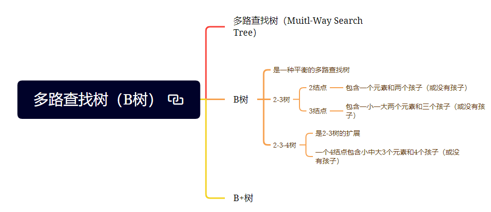

- 多路查找树（Muitl-Way Search Tree）：其每一个结点的孩子数可以多于两个，且每一个结点处可以存储多个元素。
- 2-3树：是一棵多路查找树，其中每一个结点都具有两个孩子（称为2结点）或三个孩子（称为3结点）。一个2结点包含一个元素和两个孩子（或没有孩子），一个3结点包含一小一大两个元素和三个孩子（或没有孩子）。
- 2-3-4树：是2-3树的概念扩展，包括了4结点的使用，一个4结点包含小中大3个元素和4个孩子（或没有孩子）。
- B树：是一种平衡的多路查找树，结点最大的孩子数目称为B树的阶。

## 8. 散列表查找（哈希表）概述

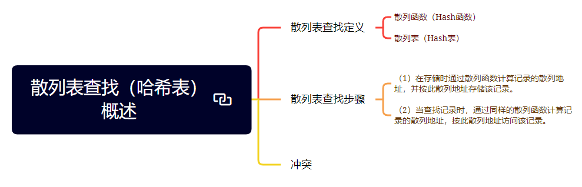

- 散列函数（Hash函数）：在记录的存储位置和它的关键字之间建立一个确定的对应关系 $f$，使得每个关键字`key`对应一个存储位置 $f(key)$。
- 散列表（Hash表）：采用散列技术将记录存储在一块连续的存储空间中，这块连续存储空间称为散列表或哈希表
- 冲突：当两个关键字$\text{key}_1 \neq \text{key}_2$，但是却有$f(\text{key}_1) = f(\text{key}_2)$，这种现象称为冲突，并把$\text{key}_1$和$\text{key}_2$称为这个散列函数的同义词。

## 9. 散列函数的构造方法

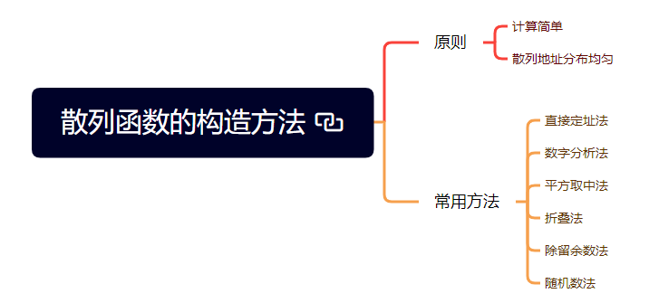


- 直接定址法：直接计算散列函数得到散列地址的方法，其中，取关键字的某个线性函数值为散列地址，公式如下：
$$
f(\text{key}) = a * key + b （a、b为常数）
$$
- 数字分析法：抽取关键字的一部分计算散列存储位置，通常适合处理关键字位数比较多的情况，如果事先知道关键字的分布且关键字的若干位分布较均匀，可以考虑使用这个方法。
- 平方取中法：可以抽取中间几位作为散列地址，再进行平方取值。适合不知道关键字的分布，而位数又不是很多的情况。
- 折叠法：将关键字从左到右分割成位数相等的几部分，然后将这几部分叠加求和，并按散列表表长，取后几位作为散列地址。
- 除留余数法：使用如下散列函数计算散列地址
$$
f(\text{key}) = \text{key} \bmod p \quad (p \leqslant m)
$$
- 随机数法：选择一个随机数，取关键字的随机函数值为散列地址，即
$$
f(\text{key}) = \text{random}(\text{key})
$$


直接定址法：

```c++
int hash_direct_addr(int key){
    return 2*key + 1;
}
```

数字分析法：

```c++
int hash_digit_analyze(const char *key, int len){
    if(key == NULL || len < 0)
        return -1;
    char number[4];
    int j = 3;
    for (int i = len - 1; i > len - 5; --i) {
        number[j] = key[i];
        j--;
    }
    return strtol(number, NULL, 10);
}
```


平方取中法：

```c++
int hash_square(int key){
    int m = 100, b = 3;
    int value = key * key;
    char str[32];
    sprintf(str, "%d", value);
    int index = (strlen(str) - b - 1) / 2;
    char number[b - 1];
    int j = 0;
    for (int i = index; i < index + b - 1; ++i) {
        number[j] = str[i];
        j++;
    }
    return strtol(number, NULL, 10);
}
```

折叠法：

```c++
int hash_fold(int key){
    int m = 100, b = 3;
    char str[32];
    sprintf(str, "%d", key);
    int count = 0, len = strlen(str);
    for (int i = 0; i < len; i += b) {
        int temp = 0;
        for (int j = 0; j < b && i + j < len; ++j) {
            temp = (int)(temp + pow(str[i + j] - 48, b - j));
        }
        count += temp;
    }
    char value[32];
    sprintf(value, "%d", count);
    int l = strlen(value);
    if(l <= b)
        return count;
    int hash = 0;
    for (int k = 0; k < b; ++k) {
        hash = (int)(hash + pow(str[l - 1 - k] - 48, k + 1));
    }
    return hash;
}
```


除留余数法：

```c++
int hash_mod(int key){
    int m = 20;
    return key % m;
}
```
随机数法：

```c++
static unsigned int randseed = 1103515245;
int hash_rand(int key){
    int m = 100;
    unsigned int r;
    r = randseed = key * randseed + 12345;
    return ((r << 16) | ((r >> 16) & 0xFFFF)) % m;
}
```

## 10. 处理散列冲突的方法

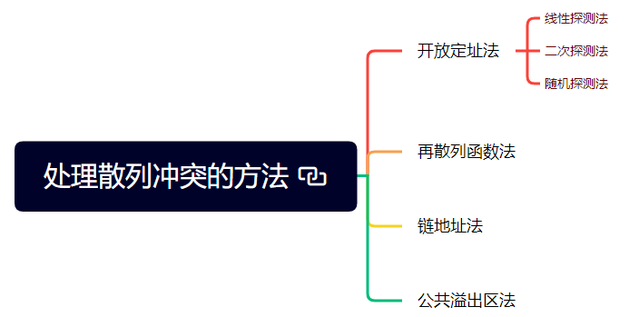

- 开放定址法：一旦发生了冲突，就去寻找下一个空的散列地址，只要散列表足够大，空的散列地址总能找到，并将记录存入。公式如下：
$$
f_i (\text{key}) = (f(\text{key}) + d_i) \ \text{MOD} \ m \quad (d_i = 1, 2, 3, \cdots, m - 1)
$$
- 再散列函数法：使用不同的散列函数
$$
f_i (\text{key}) = \text{RH}_i (\text{key}) \quad (i=1,2,\cdots,k)
$$
- 链地址法：将所有关键字为同义词的记录存储在一个单链表中，该表称为同义词子表，在散列表中只存储所有同义词子表的头指针。
- 公共溢出区法：为所有冲突的关键字建立一个公共的溢出区来存放，在查找时，对给定值通过散列函数计算出散列地址后，先与基本表的相应位置进行对比，如果相等，则查找成功；如果不相等，则到溢出表中进行顺序查找。

## 练习

### 简单题3个


### 中等题2个


### 困难题1个


